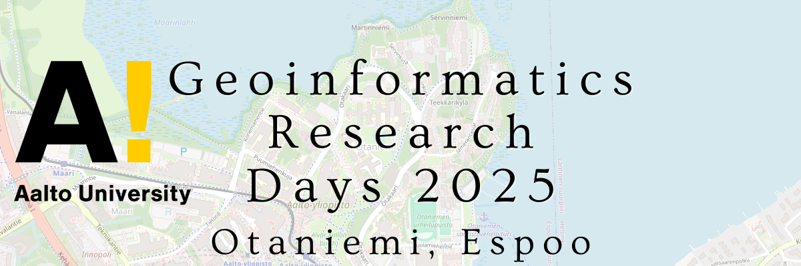

The *Geoinformatics Research Days* event is the annual gathering for geoinformatics experts in Finland, 
which has been arranged by the member universities of the 
**Finnish University Network for Geoinformatics (Fiuginet)** for over 10 years.

Traditionally, the Research Days have been a relatively small-scale event with mostly invited programme. 
However, in 2023 *Fiuginet* made the decision to develop the event into a scientific conference, and therefore 
we are proud to announce the **Call for papers** for *Geoinformatics Research Days 2024*. 
The event will take place on May 20-21st, 2024 and will be organized by *Aalto University* together with the *Fiuginet* network, 
hosted in *Espoo, Finland.* The event is held together with the ICA Commission on Cognitive Issues in Geographic Information 
Visualisation with targeted sessions and their members are also warmly welcome.

We invite researchers, practitioners, and experts from academia, industry, and government sectors both in 
Finland and abroad to submit their research contributions for presentation during the *Geoinformatics Research Days 2024*. 
The conference will cover a broad spectrum of topics related to Geoinformatics, including but not limited to:

1. Geospatial Data Acquisition and Processing
2. Geographic Information Systems (GIS) and Remote Sensing
3. Spatial Data Analysis and Visualization
4. Geospatial Algorithms and Modeling
5. User Cognition in Geospatial Applications
6. Geoinformatic Human-Computer Interaction
7. Location-Based Services and Geographic Information Retrieval
8. Big Data Analytics for Geospatial Applications
9. Spatial Data Infrastructures and Interoperability
10. Geoinformatics for Smart Cities and Urban Planning
11. Environmental Monitoring and Geospatial Solutions
12. Geoinformatics for Sustainable Development
13. Geospatial AI and Machine Learning Applications
14. Open Geospatial Science and Open Source Software
15. Papers aimed at the programme related to the **ICA Commission on Cognitive Issues in Geographic Information Visualization**

Your participation in the *Geoinformatics Research Days 2024* will make a significant contributions, foster collaboration,
and shape the future of Geoinformatics. Together, let's advance the understanding and application of geospatial technologies 
for a more sustainable and interconnected world.

Submission guidelines
======================

Presenters are invited to submit an extended abstract of a maximum of 1000 words (approximately 2 pages of text) in English. 
In your paper please note if your paper is aimed at the ICA CogVIS programme track. 

All submitted papers will be peer-reviewed to ensure the quality of the contributions. 
All accepted publications will be given a chance to present their work at the *Geoinformatics Research Days 2024*.

.. attention:: 
    - Notification of acceptance: April 23rd 2024
    - Conference dates: 20-21 May

.. - Abstract `Submission Opens <https://easychair.org/my/conference?conf=grd24>`_: January 30th, 2024
.. - Abstract submission deadline: March 8th 2024
.. - Notification of acceptance: April 23rd 2024

.. Paper submission
.. ================

.. Please submit your paper to the Geoinformatics Research Days using **EasyChair**.

.. .. admonition:: Until March 8th 2024    

..   .. button-link:: https://easychair.org/my/conference?conf=grd24
..       :color: primary
..       :shadow:
..       :align: center

..       👉 Submission!

Event registration
====================

.. admonition:: Registration

  Please confirm your participation to the conference by filling this form.

  .. button-link:: https://link.webropolsurveys.com/S/0CB43272A49318CD
      :color: primary
      :shadow:
      :align: center

      👉 Registration form

Programme
============

Monday 20th
------------

.. raw:: html 

    

        
        

        <table style="width:100%">
            <tr>
            <th>Time</th>
            <th aligns="center">Details</th>
            </tr><ul>

            <tr>
            <td>09:00   09:30</td>
            <td>
                <ul>
                    
Morning coffee

                
                </ul></ul>
            </td>
            </tr>

            <tr>
            <td>09:30   09:40</td>
            <td>
                <ul>
                    
Welcome

                </ul>
            </td>
            </tr>

            <tr>
            <td>09:40   11:30</td>
            <td>
                <ul>
                    
<b><u>Keynote presentations </u></b>

                <ul>

                    <li><b>9:40 - 10:35: </b>Quantitative conservation geography: relevant data, methods and emerging technologies - Prof. Enrico Di Minin, University of Helsinki</li>                
                    
                    <li><b>10:35 - 11:30: </b>Mapping challanges and opportunities towards sustainable food future - Prof. Matti Kummu, Aalto University </li>
                
                </ul>
                </ul>
                
            </td>
            </tr>

            <tr>
            <td>11:30   12:45</td>
            <td>
                <ul>
                    
Lunch

                </ul>
            </td>
            </tr>

            <tr>
            <td>12:45   13:00</td>
            <td>
                <ul>
                    
<u><b>Session 1: Geospatial approaches to spatial mobility, accessibility and exposure</u></b>

                    
<b> (Chair: Henrikki Tenkanen)</b>

                <ul>

                    <li><b>12:45 - 13:05</b> Access to green travel in Europe - Comparison across 43 large cities  <i>(Klein, R., E. Willberg, C. Fink, R. Heinonen, S. Korpilo & T. Toivonen)</i> </li>

                    <li><b>13:05 - 13:25</b> Near Real-Time Measures of Interregional Mobility Restrictions on COVID-19 Transmission.  <i>(Cesar Marin Flores, Jesus Berrios, Bernardo Gutierrez, Loreto Bravo and Leo Ferres)</i> </li>

                    <li><b>13:25 - 13:45</b> Traffic state estimation using crowd-sourced trajectory data in low- and middle-income cities <i>(Subhrasankha Dey)</i> </li>

                    <li><b>13:45 - 14:05</b> Revealing Uncertainties in Noise Modelling  <i>(Zulfa Nuraini Afifah)</i> </li>

                </ul>
            </td>
            </tr>

            <tr>
            <td>11:30   12:45</td>
            <td>
                <ul>
                    
Lunch

                </ul>
            </td>
            </tr>

            <tr>
            <td>14:05   14:30</td>
            <td>
                <ul>
                    
Coffe break 

            </td>
            </tr>

            <tr>
            <td>14:30   15:50</td>
            <td>
                <ul>
                    
<u><b>Session 2: ICA CogVis Commission</u></b>

                    
<b> (Chair: Pyry Kettunen)</b>

                <ul>

                    <li><b>14:00 - 14:20</b> The International Cartographic Association Commission on Cognitive Issues in Geographic Information Visualisation  <i>(Pyry Kettunen, Tumasch Reichenbacher, Hua Liao and Petr Kubíček)</i> </li>

                    <li><b>14:20 - 14:40</b> The International Cartographic Association Commission on the User Experience: Activities, Outcomes, and Research Agenda  <i>(Robert Roth)</i> </li>

                    <li><b>14:40 - 15:00</b> Emerging Cartographic Research Challenges in GeoAI  <i>(Anthony Robinson, Arzu Çöltekin, Amy Griffin and Florian Ledermann)</i> </li>

                    <li><b>15:00 - 15:20</b> Map-reading effects of white and green as dominant background colour in a topographic map  <i>(Pyry Kettunen)</i> </li>

                </ul>
            </td>
            </tr>

            <tr>
            <td>15:50   16:00</td>
            <td>
                <ul>
                    
Closing of the first day 

            </td>
            </tr>
            
        </table>

    

Tuesday 21st 
--------------

.. raw:: html 

    

        
        

        <table style="width:100%">
            <tr>
            <th>Time</th>
            <th aligns="center">Details</th>
            </tr><ul>

            <tr>
            <td>09:30   10:00</td>
            <td>
                <ul>
                    
Morning coffee

                
                </ul></ul>
            </td>
            </tr>

            <tr>
            <td>10:00   10:05</td>
            <td>
                <ul>
                    
Welcome

                </ul>
            </td>
            </tr>

            <tr>
            <td>10:05   10:50</td>
            <td>
                <ul>
                    
<b><u>GeoSPA Talks Keynote</u>  (Chair: Kamyar Hasanzadeh)</b>

                <ul>
                <li>Place Representation and Place Communication: A Challenge for Geographical Information Science - Prof. Franz-Benjamin Mocnik, University of Salzburg</li>        
                </ul>
                </ul>
                
            </td>
            </tr>

            <tr>
            <td>10:50   12:00</td>
            <td>
                <ul>
                    
<b>Panel discussion - GeoAI: Prospects and challenges of AI in GIScience and Earth Observation (Chair: Henrikki Tenkanen)</b>

                </ul>
                
            </td>
            </tr>

            <tr>
            <td>12:00   13:15</td>
            <td>
                <ul>
                    
Lunch

                </ul>
            </td>
            </tr>

            <tr>
            <td>13:15   14:55</td>
            <td>
                <ul>
                    
<u><b>Session 4: GeoAI and Machine learning approaches with spatial data</u></b>

                    
<b> (Chair: TBC)</b>

                <ul>

                    <li><b>13:15 - 13:35</b> Geodata acquisition from unstructured texts – Introducing an open-source tool for geoparsing Finnish <i>(Tatu Leppämäki, Tuuli Toivonen and Tuomo Hiippala)</i> </li>
 
                    <li><b>13:35 - 13:55</b> Integrating machine learning approaches for predicting heat stress: A case study of Glasgow city  <i>(Newsha Modjrian and Rohinton Emmanuel)</i> </li>

                    <li><b>13:55 - 14:15</b> Detection of water pans for cattle in agropastoral areas of Taita Taveta County in Kenya  <i>(Pauline Ogola, Ian Ocholla, Petri Pellikka, Gretchen Gettel, Ilja Vuorinne and Janne Heiskanen) </i> </li>

                    <li><b>14:15 - 14:35</b> Exploring high resolution aerial imagery and computer vision models for counting cattle in Kenyan rangelands  <i>(Ian Ocholla, Petri Pellikka, Faith Karanja, Ilja Vuorinne, Tuomas) </i> </li>

                    <li><b>14:35 - 14:55</b> Detecting a keystone species aspen in boreal forests using remote sensing  <i>(Sonja Kivinen, Topi Tanhuanpää, Arto Viinikka, Janne Mäyrä, Sarita Keski-Saari, Anton Kuzmin, Pekka Hurskainen, Ida Palmroos, Pasi Korpelainen, Petteri Vihervaara and Timo Kumpula) </i> </li>

                </ul>
            </td>
            </tr>

            <tr>
            <td>14:55   15:10</td>
            <td>
                <ul>
                    
Closing the conference 

            </td>
            </tr>
            
        </table>

    

Venue
======

Event at: **Kemistintie 1**, lecture hall A305 Ke1, Otaniemi, Finland.

.. raw:: html
  

  

  <iframe 
    src="https://www.google.com/maps/embed?pb=!1m18!1m12!1m3!1d1668.163181635516!2d24.823788721943302!3d60.18418286977455!2m3!1f0!2f0!3f0!3m2!1i1024!2i768!4f13.1!3m3!1m2!1s0x468df59322d928f5%3A0x22ff74ac329934e6!2sKemian%20tekniikka%2C%20Kemistintie%201%2C%2002150%20Espoo!5e0!3m2!1sen!2sfi!4v1713864053500!5m2!1sen!2sfi" 
    width="100%" 
    height="500" 
    style="border:0;" 
    allowfullscreen="" 
    loading="lazy" 
    referrerpolicy="no-referrer-when-downgrade">
  </iframe>
  

Scientific committee
====================

- `Antikainen, Harri <https://www.oulu.fi/en/researchers/harri-antikainen>`_ (University of Oulu)
- `Hasanzadeh, Kamyar <https://www.helsinki.fi/en/about-us/people/people-finder/kamyar-hasanzadeh-9481798>`_ (University of Helsinki)
- `Kettunen, Pyry <https://www.maanmittauslaitos.fi/en/research/contact-information/staff/pyry-kettunen>`_ (Finnish Geospatial Research Institute)
- `Krisp, Jukka <https://www.uni-augsburg.de/en/fakultaet/fai/geo/prof/geoagi/geoagi-team/j-krisp/>`_ (University of Augsburg)
- `Käyhkö, Niina <https://www.utu.fi/en/people/niina-kayhko>`_ (University of Turku)
- `Lensu, Anssi <https://www.jyu.fi/en/people/anssi-lensu>`_ (University of Jyväskylä)
- `Nikander, Jussi <https://www.aalto.fi/en/people/jussi-nikander>`_ (Aalto University)
- `Tenkanen, Henrikki <https://www.aalto.fi/en/people/henrikki-tenkanen>`_ (Aalto University)
- `Toivonen, Tuuli <https://www.helsinki.fi/en/about-us/people/people-finder/tuuli-toivonen-9016861>`_ (University of Helsinki)

Contact
===============

For any inquiries or further information, please contact chairman of the Scientific Committee, `Jussi Nikander <https://www.aalto.fi/en/people/jussi-nikander>`_.
  

..
  .. toctree::
    :maxdepth: 2
    :caption: Contents:
    :hidden:

    Theme<tabs/theme>
    Partners<tabs/partners>
    Researchers and Students<tabs/researchers>
    Full schedule<tabs/schedule>
    Kick-off meeting<tabs/kick_off>
    Accomodation<tabs/accommodation>   
    Materials & Info<tabs/materials/index>

..
               Indices and tables
               ==================

               * :ref:`genindex`
               * :ref:`modindex`
               * :ref:`search`
